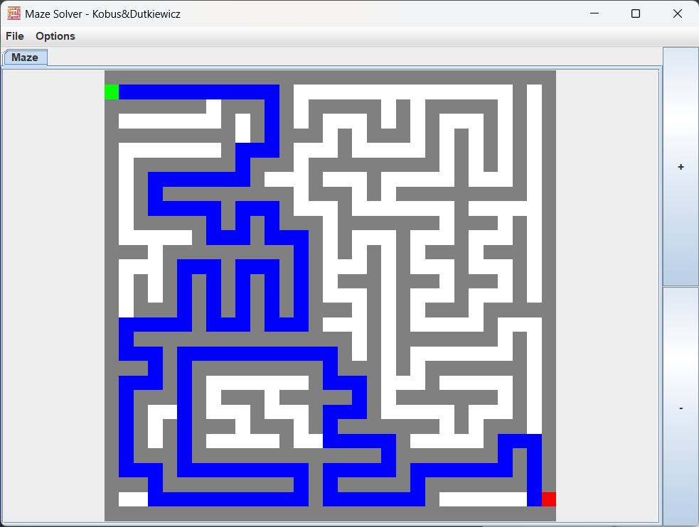
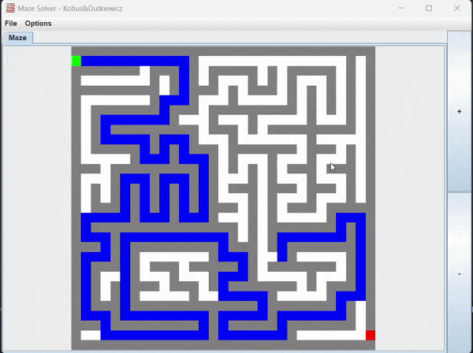

# Maze Generator and Solver

## Authors: Stanisław Dutkiewicz, Filip Kobus
## Table of Contents
1. [Introduction](#introduction)
2. [Features](#features)
3. [Visuals](#visuals)
3. [Installation](#installation)
4. [Usage](#usage)
5. [Classes Overview](#classes-overview)
6. [Documentation](#documentation)


## Introduction
This project is a Java-based application designed to open and solve mazes using various algorithms. It provides a graphical user interface to visualize the maze and the solving process. The application is structured to be modular and extensible, allowing easy integration of new maze generation and solving algorithms.

## Features
- 🗂️ **Open maze from text or binary files.**
- 🤖 **Solve mazes using various algorithms (BFS and DFS).**
- 🖥️ **Visualize the maze generation and solving processes.**

## Visuals
<div style="display: flex; justify-content: space-between;">
    
    
</div>

## Installation
To install and run this project, follow these steps:

1. **Clone the repository:**
   ```sh
   git clone <repository-url>
    ```
   
2. **Navigate to the project directory:**
   ```sh
   cd maze-generator-and-solver
   ```

3. **Compile the project:**
   ```sh
   javac -d bin src/*.java
    ```
   
4. **Run the project:**
    ```sh
    java -cp bin Main
     ```
   
Alternatively, you can open the project in an IDE such as IntelliJ IDEA or Eclipse and run the `Main` class or launch the jar file located in the in main directory.

## Usage
1. Launch the application by running the `Main` class.
2. Use the graphical user interface to generate and solve mazes.
3. Select the desired algorithm for maze generation and solving from the interface.


## Project Structure
```plaintext
maze-generator-and-solver/
├── bin/
│   └── ... (compiled classes)
├── src/
│   ├── gallery/
│   │   └── logo.png
│   ├── main/
│       ├── java/
│           ├── Algorithm/
│           │   ├── AlgorithmBfs.java
│           │   ├── AlgorithmDfs.java
│           │   ├── Binary.java
│           │   ├── DataArray.java
│           │   └── Point.java
│           ├── FileIO/
│           │   └── FileIO.java
│           ├── GUI/
│           │   ├── MainGuiPanel.java
│           │   ├── MazeRenderer.java
│           │   └── MazeUtilities.java
│           └── Main.java
├── Dokumentacja/
│   ├── Documentation.pdf
│   └── JIMP2_Java_Document_English.pdf
├── JIMP2_Projekt_Java.jar  # Compiled JAR file located in the root directory
└── LICENSE
````
## Classes Overview
- `Main`: The entry point of the application.
- `MazeRenderer`: Handles the graphical representation of the maze.
- `MazeUtilities`: Provides utility functions for maze operations.
- `MainGuiPanel`: Manages the main graphical user interface panel.
- `FileIO`: Handles file input and output operations.
- `AlgorithmDfs`: Implements the Depth-First Search algorithm for maze generation and solving.
- `AlgorithmBfs`: Implements the Breadth-First Search algorithm for maze solving.
- `Binary`: Contains utility functions related to binary operations.
- `DataArray`: Manages the data structures used in the maze.
- `Point`: Represents a point in the maze.

## Documentation

To find detailed information about the classes and methods used in this project, refer to the documentation located in 'Dokumentacja' directory.
[Documentation.pdf](./Dokumentacja/JIMP2_Java_Document_English.pdf)

## License
This project is licensed under the MIT License - see the [LICENSE](LICENSE) file for details.


